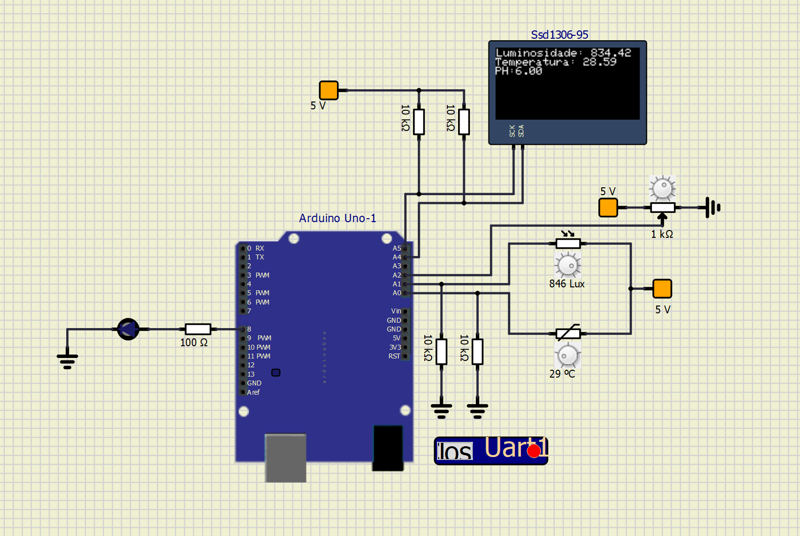
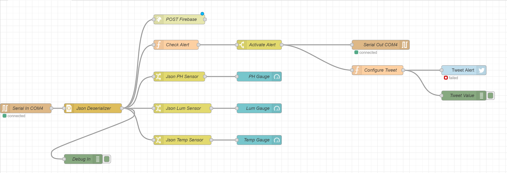
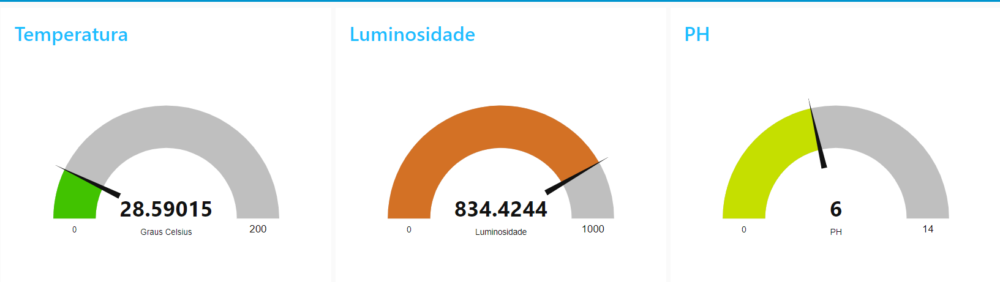
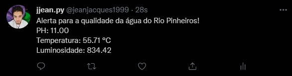

# Tech 4 Good - Arduino

Hardware e software onde o arduino coleta a cada 30 segundos as informações dos sensores (pH, temperatura e turbidez) e pública cada dado em um tópico via protocolo MQTT. O sistema no Node-Red irá subscrever os tópicos MQTT e irá salvar os dados em um banco de dados Firebase além de exibir as informações em um dashboard para monitoramento do usuário. É realizado o acionamento de um alarme no Arduino utilizando um LED, acionado via tópico do MQTT. Também é feita a publicação no Twitter sempre que o alarme for acionado.

## Arduino

Modelo físico da placa Arduino e sensores potenciometro, luminosidade e temperatura.

## NodeRed

Arquitetura desenvolvida no Node-RED.

## Dashboard

Dashboard com dados colestados

## Twitter

Alertas sendo publicados no Twitter.

Link Twitter: https://twitter.com/jeanjacques1999

## Demonstração

Vídeo demonstração

## Grupo

- Felipe Toscano da Silva – RM 81515
- Gabriel Siqueira Petillo – RM 81238
- Giovanna Marinho Pereira de Godoy – RM 80534
- Jean Jacques Nascimento Barros – RM 81524
- Vinicius Mota Pereira Silva – RM 80101